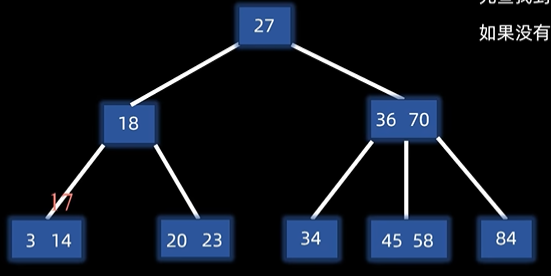
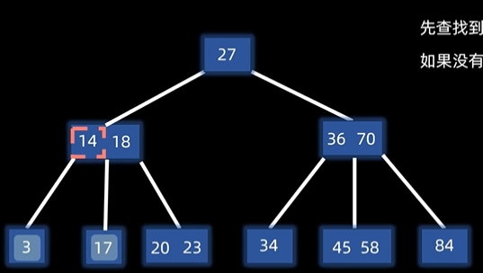
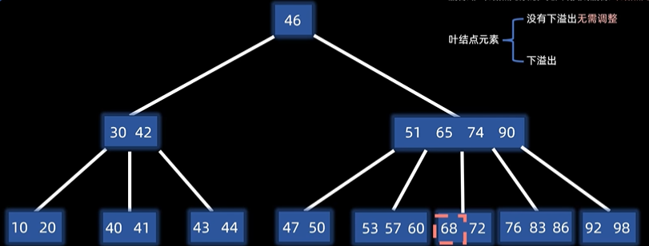
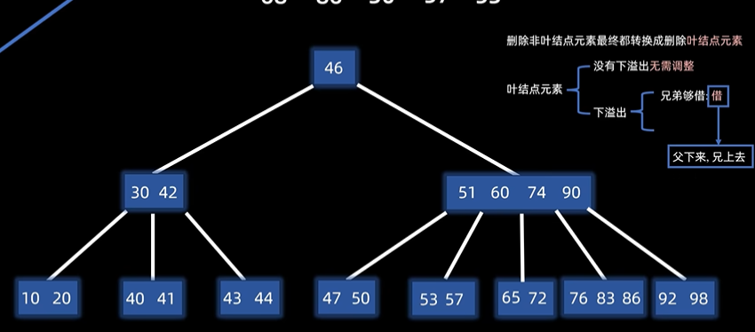
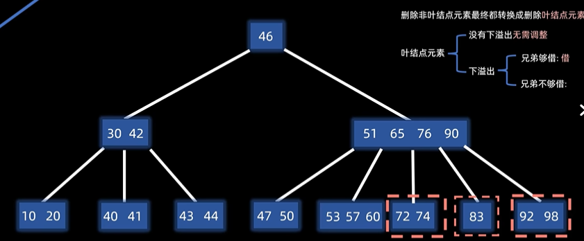
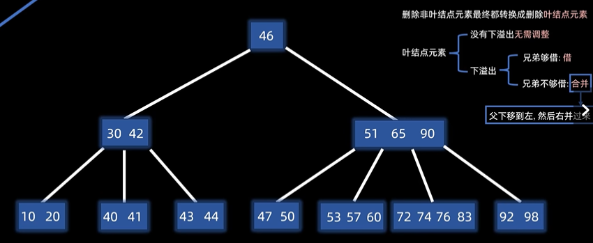
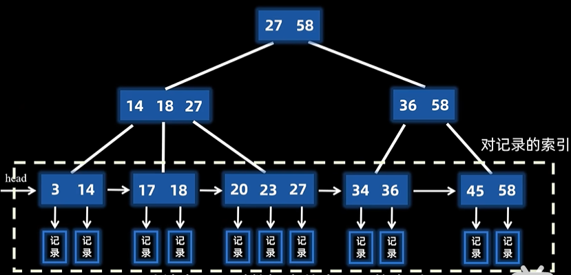
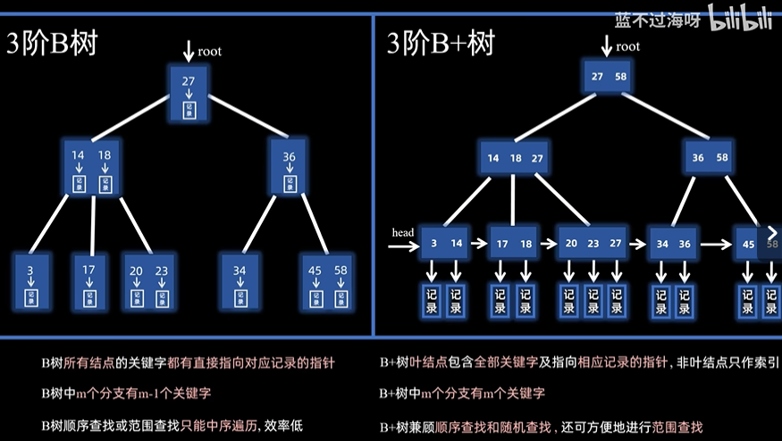

# Project 1 
## [01 ： ExtendibleHashTable(可扩展的哈希表)](https://www.geeksforgeeks.org/extendible-hashing-dynamic-approach-to-dbms/)(https://zhuanlan.zhihu.com/p/571927310)
- 1.src/include/container/hash/extendible_hash_table.h
- 2.src/container/hash/extendible_hash_table.cpp

## [02 : LRU-K 更换政策 ](https://tonixwd.github.io/2024/02/12/CMU15445/proj1/)

- 1. src/include/buffer/lru_k_replacer.h 
- 2. src/buffer/lru_k_replacer.cpp

## [03 : 缓冲池管理器实例 ](https://tonixwd.github.io/2024/02/12/CMU15445/proj1/)

- 1. src/include/buffer/buffer_pool_manager_instance.h
- 2. src/buffer/buffer_pool_manager_instance.cpp

# Project 2

##  m 阶 B 树 : 由于 平衡二叉树 不适合磁盘存储,所以引入 B 树，B 树是一种多路搜索树，它是一种平衡树，它的每个节点可以有多个子节点。 它的搜索时间复杂度为 O(log n)。
- 访问结点是在硬盘中进行的， 结点内的查找操作是在内存中进行的
- 性质部分：
    1. 平衡：所有的叶节点都在同一层。
    2. 有序： 结点内有序， 任一元素的左子树都小于它，右子树都大于它。
    3. 多路： 对于 m 阶 B 树：
        - 每个节点最多有 m 个子节点。
        - 每个节点最多有 m - 1 个关键字。
        - 根节点最少： 2 个分支， 1 个元素
        - 其他结点： 最少有 (m / 2) 上取整 个分支， (m / 2) - 1 个元素 ：上取整就是 大于等于 这个数的最小整数。

- 插入操作：
    1. 找到要插入的位置。
    2. 如果该节点未满，直接插入。
    3. 如果该节点已满，分裂节点。
    4. 分裂节点：
        - 如图所示：
        - 当前插入17之后，节点已满，分裂节点。
          - 分裂结点：
            - 注意取的元素都是(m / 2) 上取整个元素。 
            - 找到中间元素 14，将其插入到父节点中，并且检查父节点是否已满。如果已满的话继续分裂节点，直到父节点未满。
              - 如果分裂到根节点，并且根节点也满了，就需要创建一个新节点，用来存储中间节点，并将两边进行分裂
    4. 结果如图：
        - 
        
- 删除操作：
    删除非叶节点的元素最终都转换成删除叶节点的元素。
    1. 如果要删除根节点，需要从根节点的左子树的最右边的叶子节点的最后一个元素或者右子树的最左边的叶子节点的第一个元素中选择一个元素来代替根节点。

    对于删除叶节点的元素：
    1. 如果没有出现下溢出就无需调整
    2. 如果出现了下溢出，就需要调整
        - 如图所示： 
        - 要删除68， 68 是叶子节点的元素，但是叶子节点的元素不足，所以需要调整。
        - 调整的方式：
          - 尝试从左右兄弟里面借一个出来：
        - 如果左右兄弟只有一个可以借或者两个都可以借，就从左右兄弟里面借一个出来。
            - 如这个题目所示，68删除之后，就直接将65接下来，把72和65放在一起，然后将60移动上去到65的位置就可以了。
            - 
            - 其实这个题目还可以，让74和72放一起作为根节点，然后将76移动上去
        - 如果左右两个兄弟都不够借，就随便挑一个兄弟进行合并操作：
            - 如图所示： 删除86之后就是这样的情况
            - 这样的情况下就需要将83和左右节点其中一个进行合并操作，将76合并在 72 和 74 上，然后作为一个新的节点，然后将83移动上去。
            - 
###### 在进行调整的时候需要考虑父节点的上溢或者下溢情况

## B+树

## [01 : B + 树页面]

- 1. src/include/storage/page/b_plus_tree_internal_page.h
- 2. src/storage/page/b_plus_tree_internal_page.cpp

