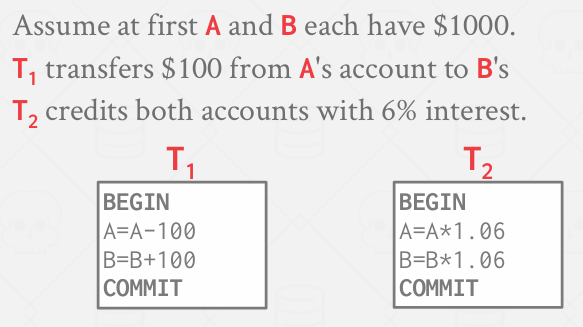

## acid 
- 原子性（Atomicity）：事务中的所有操作要么全部执行，要么全部不执行。“要么全有，要么全无……”
- 一致性（Consistency）：如果每个事务都是一致的，且数据库初始状态是一致的，那么最终状态也将保持一致。“在我看来一切正常……”
- 隔离性（Isolation）：一个事务的执行与其他事务的执行相互隔离。“我独自进行……”
- 持久性（Durability）：事务一旦提交，其影响将持续存在。“我会留存……”

### 事务的原子性
- 执行一个事务有两种可能的结果：
→ 在完成其所有操作后提交。
→ 在执行了部分操作后中止（或由数据库管理系统中止）。
- 数据库管理系统保证事务具有原子性。
→ 从用户的角度来看：事务要么执行其所有操作，要么根本不执行任何操作。
#### 场景

- 场景 1：→ 我们从安迪的账户取出 100 美元，但在转账前数据库管理系统中止了该事务。

- 场景 2：→ 我们从安迪的账户取出 100 美元，但在转账前发生了停电。
- 两个事务都中止后，安迪账户的正确状态应该是什么？

#### 解决方案
- 方法 1：日志记录
    → 数据库管理系统记录所有操作，以便能够撤销已中止事务的操作。
    → 在内存和磁盘中都维护撤销记录。
    → 可以把这想象成飞机上的黑匣子……
- 几乎每个数据库管理系统都使用日志记录。
    → 审计追踪
    → 出于效率考量
- 方法 2：影子分页（Shadow Paging）
    → 数据库管理系统创建页面副本，事务对这些副本进行修改。只有当事务提交时，页面才会对其他事务可见。
    → 最初源自 IBM System R。
- 采用此方法的系统较少：
    → CouchDB
    → Tokyo Cabinet
    → LMDB（OpenLDAP ）

### 事务的一致性 这个主要是要在分布式系统上才需要考虑这个问题
- 数据库所代表的 “世界” 在逻辑上是正确的。所有关于数据的询问都能得到逻辑上正确的答案。
    数据库一致性
    事务一致性
#### 数据库的一致性：数据库准确地对现实世界进行建模，并遵循完整性约束。未来的事务能在数据库中看到过去已提交事务产生的影响。

### 事务的隔离性
- 用户提交事务，每个事务的执行就好像它是单独运行的：→ 这样的编程模型更易于分析推理。
- 但数据库管理系统是通过交错执行事务的操作（对数据库对象的读 / 写操作）来实现并发的。
- 我们需要一种方法来交错执行事务，同时仍使其看起来像是按顺序依次执行的。

#### 确保隔离性的机制
- 并发控制协议是数据库管理系统（DBMS）用来决定如何合理交错执行多个事务操作的方式。
- 协议分为两类：→ 悲观（Pessimistic）：从一开始就防止问题出现。→ 乐观（Optimistic）：假定冲突很少发生，在冲突发生后再进行处理。
- 
- 调度的形式属性：
  - 串行调度→ 一种不交错执行不同事务操作的调度方式。
  - 等价调度→ 对于任何数据库状态，执行第一个调度的效果与执行第二个调度的效果相同。→ 算术运算具体是什么并不重要

#### 冲突操作
- 我们需要一个基于 “冲突” 操作概念、能高效实现的形式化等价概念。

- 当满足以下条件时，两个操作发生冲突：
→ 它们来自不同的事务，
→ 它们作用于同一对象，且其中一个操作是写操作。

- 交错执行异常
→ 读 - 写冲突（R - W）
→ 写 - 读冲突（W - R）
→ 写 - 写冲突（W - W）